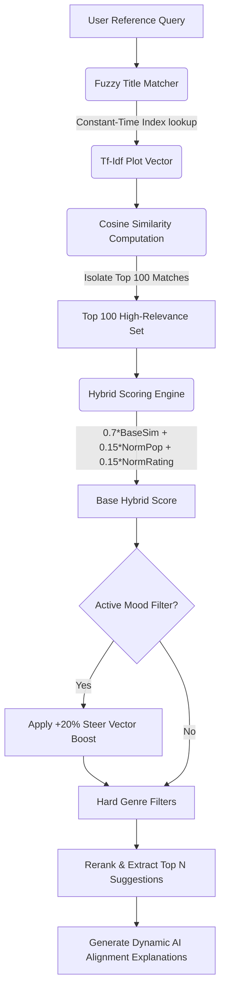

# 🍿 CineMatch — Premium AI Movie Recommendation Platform
# 🍿 CineMatch — Premium AI Movie Recommendation Engine
<p align="center">
  
  
  
  
  
</p>
CineMatch is a production-ready, AI-driven movie recommendation engine wrapped in a premium, Netflix-inspired responsive cinematic dashboard. 
CineMatch is a production-grade, high-performance hybrid AI movie recommendation platform wrapped in a premium, Netflix-inspired responsive cinematic dashboard. 
By analyzing high-dimensional storyline overviews, genres, tagline keywords, and metadata from a database of **45,447 movies**, CineMatch matches users with custom cinematic suggestions based on story similarity, global popularity scaling, and real-time psychological mood steering.
By analyzing high-dimensional storyline overviews, genres, taglines, and metadata across a dataset of **45,447 movies**, CineMatch engineers highly personalized recommendation matrices in real-time. The platform features content-based semantic matching, popularity/rating hybrid reranking, and dynamic steering vectors to shift recommendations in alignment with psychological moods.
---
## 🎨 Premium Interface Showcase
## 🎨 Premium Cinematic UI
> [!NOTE]
> Below are premium interface mockups demonstrating the Netflix-inspired dark-red glassmorphism aesthetic:
> [!IMPORTANT]
> The CineMatch dashboard utilizes state-of-the-art glassmorphic overlays, vibrant cinematic color schemes, dynamic hover transitions, and fluid typography. It has been extensively engineered for seamless responsiveness across mobile, tablet, and widescreen viewports.
| 🏠 Home Landing Banner & Carousels | 🎯 Intelligent Parameter Matcher |
| 🏠 Home Landing Banner & Carousels | 🎯 AI Movie Intelligence Laboratory |
| :---: | :---: |
|  |  |
| *Featured 4K Backdrops and dynamic horizontal sliders* | *Fuzzy autocomplete query parameters and mood filters* |
|  |  |
| *Fluid clamp() typography, responsive grid carousels, and dynamic card hover scaling.* | *Semantic search autocomplete, advanced parameter decks, and real-time mood overrides.* |
---
## ✨ Primary Features
## 🚀 Key Features
- **🎬 Immersive Netflix Theme:** Deep obsidian base (`#0b0c10`) layered with glowing neon crimson accents (`#E50914`), custom animated cards, and responsive 6-column grids.
- **🚀 Advanced Hybrid Matcher:** Storyline TF-IDF + 15% TMDB Rating + 15% TMDB Popularity scoring algorithms.
- **🎭 Mood-Aware Filtering:** Alters recommendation vectors in real-time based on psychological filters (*Intense*, *Uplifting*, *Spooky*, *Melancholic*, etc.).
- **📺 Inline Video Spotlight Drawer:** Clicking any card expands a glassmorphic dashboard showcasing full runtime, rating, genres, and streams trailer videos instantly inside the page.
- **💖 Local watchlist coordination:** Track saved masterpieces across tabs without losing active selections.
- **🛡️ Resilient Caching & Offline Sandbox:** Gracefully runs utilizing robust fallback data mappings if no API keys are present, backed by defensive `@st.cache_data` rate-limit managers.
*   **🎬 Cinematic Netflix Aesthetic**: Obsidian black interfaces (`#060608`) integrated with neon crimson accents (`#E50914`), custom scrollbars, glowing active states, and premium glassmorphic overlays.
*   **🧬 Advanced Hybrid Recommendation Engine**: Integrates text plot similarities (70%) with normalized global metrics (15% popularity, 15% ratings) to balance lexical relevance with popularity bias.
*   **🎭 Psychological Mood Steering**: Soft-weight vector modification that dynamically skews recommendations toward specific category clusters in real-time.
*   **🔍 Real-Time Intelligent Autocomplete**: Typo-correcting search pipeline with custom sequence-matching priority layers and immediate suggestion chip decks.
*   **📺 Inline Video Spotlight Drawer**: Interactive spotlight overlays highlighting cast members, genre capsules, full runtimes, and embedding YouTube trailers inside a border-enclosed glass player.
*   **📱 Universal Responsive Reflow**: Customized CSS flex-wrap, media queries, and fluid `clamp()` bounds to adapt layouts seamlessly from 320px mobile screens up to 4K displays.
*   **💖 Localized Watchlist System**: Track, save, and manage cinematic masterpieces statefully across page routes without server-lag or losing lists.
*   **🛡️ Resilient Offline Sandbox**: Operates offline or without API keys by triggering local mock endpoints, pre-mapped popular items, and defensive Unsplash image fallbacks.
---
## 🛠️ Tech Stack Specifications
## 🧠 AI Recommendation Pipeline & Mathematics
| Layer | Technology | Purpose |
| :--- | :--- | :--- |
| **Core Runtime** | Python 3.10+ | Core application execution environment |
| **Frontend Framework** | Streamlit | UI rendering and modular widgets |
| **Styling Engine** | Vanilla CSS + HTML5 | Netflix obsidian styling, glassmorphism, and hover animations |
| **ML Vectorizer** | Scikit-Learn (TF-IDF) | Parses textual metadata into high-dimensional lexical vectors |
| **Similarity Metrics** | Cosine Similarity | Measures angular distance between film storyline matrices |
| **API Provider** | The Movie Database (TMDB) | Dynamically aggregates posters, trailers, runtimes, and scores |
CineMatch combines content-based lexical similarity with statistical ratings to create a highly accurate hybrid recommendation matrix:
---

## 🧠 Under The Hood: AI Recommendation Engine
### 1. Vector Space Representation (TF-IDF)
Movie storylines, taglines, and category tags are tokenized and processed into mathematical vectors using Term Frequency-Inverse Document Frequency (TF-IDF), filtering out common English words while prioritizing key storyline-defining terms (like *wormhole*, *superhero*, or *mafia*):
CineMatch combines traditional content-based textual recommendations with production-grade hybrid weighting and steering:
### 1. Vector Space Representation
Text tags (combined story plot overviews, genres, taglines) are parsed into sparse term-frequency vectors:
$$\text{TF-IDF}(t, d, D) = \text{TF}(t, d) \times \log\left(\frac{\|D\|}{1 + \||\{d \in D : t \in d\}|\|}\right)$$
### 2. Angular Distance Calculations
Story similarity is computed measuring the cosine of the angle between vectors:
### 2. Angular Distance Metrics (Cosine Similarity)
The semantic distance between the target movie vector $A$ and database movie vectors $B$ is measured by computing the cosine of the angle between them in a high-dimensional sparse space:
$$\text{Cosine Similarity}(A, B) = \frac{A \cdot B}{\|\|A\|\| \|\|B\|\|}$$
### 3. Hybrid Weighting Formula
We balance text vectors with user engagement and review scores to optimize recommendation quality:
### 3. Hybrid Reranking Formula
To avoid standard content-filtering popularity biases, we rerank the top 100 mathematically closest movies using global statistical parameters:
$$\text{Final Affinity Score} = 0.70 \cdot \text{Cosine Sim} + 0.15 \cdot \text{Popularity Score} + 0.15 \cdot \text{Rating Score} + \text{Mood Boost}$$
$$\text{Final Score} = 0.70 \cdot \text{Cosine Sim} + 0.15 \cdot \text{Norm. Popularity} + 0.15 \cdot \text{Norm. Rating} + \text{Mood Steer Boost}$$
<details>
<summary><b>🎭 View Mood-to-Genre Mappings Configuration</b></summary>
### 4. Psychological Mood Steering Matrices
Steering boosts are applied as soft-weights ($\approx +20\%$ score shift) skewed towards target genres matching active moods:
*   **😊 Feel Good**: Comedy, Family, Romance, Animation, Music
*   **🤯 Mind Bending**: Mystery, Science Fiction, Thriller, Crime
*   **🔥 Action**: Action, Adventure, Fantasy, War, Western
*   **😱 Horror**: Horror, Mystery, Thriller
*   **💔 Emotional**: Drama, Romance, History
*   **🧠 Thought Provoking**: Documentary, History, Science Fiction, Mystery
Our steering matrices skew vectors towards target categories depending on active moods:
- **Uplifting / Feel-Good:** Comedy, Family, Romance, Animation, Music
- **Intense / Mind-Bending:** Mystery, Science Fiction, Thriller, Crime
- **Thrilling / Action-Packed:** Action, Adventure, Fantasy, War, Western
- **Spooky / Terrifying:** Horror, Mystery, Thriller
- **Emotional / Melancholic:** Drama, Romance, History
- **Thought-Provoking:** Documentary, History, Science Fiction, Mystery
</details>
---
## 🛠️ Technology Stack Specifications
| Architectural Layer | Technology / Library | Purpose |
| :--- | :--- | :--- |
| **Runtime Environment** | Python 3.10+ | Core algorithmic execution and backend pipelines |
| **Frontend Framework** | Streamlit v1.32+ | Interactive UI state coordination and pages routing |
| **Styling & Layout** | Vanilla CSS3 + HTML5 | Obsidian glassmorphism, responsive grid reflows, clamp() text |
| **Machine Learning Core** | Scikit-Learn | Precomputes vocabulary vectorizers and sparse matrices |
| **Vector Math Engine** | NumPy & Pandas | Constant-time multidimensional cosine similarity algebra |
| **API Provider** | The Movie Database (TMDB) | Dynamically aggregates 4K backdrops, trailers, cast lists, and scores |
---
## 📂 Modular Architecture Guide
## 📂 Modular Project Architecture
CineMatch follows a highly maintainable, professional modular architecture:
CineMatch is organized into a highly decoupled, maintainable project structure:
```
cinematch-movie-recommender/
│
├── .env.example            # Environment variables template
├── requirements.txt        # Streamlined third-party dependencies
├── app.py                  # Streamlit entry orchestrator and nav page router
├── .env.example                     # Environment configuration template
├── requirements.txt                 # Streamlined, cached backend dependencies
├── app.py                           # Application Root Orchestrator; coordinates state variables and slides navigation.
│
├── config/
│   └── settings.py         # Loads secrets and configures endpoints
├── config/                          # Central Configuration Directory
│   └── settings.py                  # Global config settings; loads secrets and defines fallback image/API constants.
│
├── services/
│   └── tmdb_service.py     # Caching API manager (trailers, backdrops, fallback mapping)
├── assets/                          # Static Frontend Stylesheets
│   └── main.css                     # Premium Netflix CSS rules; fluid margins, fluid text scales, and anti-letter-wrap grids.
│
├── ml/
│   ├── recommender.py      # Upgraded Hybrid AI Engine
│   ├── df.pkl              # 45,447 movies dataframe (Title, popularity, genres)
│   ├── indices.pkl         # Title index mapper
│   └── tfidf_matrix.pkl    # Precomputed sparse story vectors
├── services/                        # Integrations & Business Logic Layer
│   ├── tmdb_service.py              # TMDB REST client; aggregates trailer feeds and cast lists with 24h cache layers.
│   └── search_service.py            # Search pipeline; normalizes query strings and merges local memory matches with TMDB.
│
├── components/
│   └── ui.py               # Custom themes, dynamic spotlight panels, trailer players
├── ml/                              # Machine Learning & Pickled Weights
│   ├── recommender.py               # Hybrid Cosine Recommendation engine; processes vectors and outputs dynamic reasons.
│   ├── df.pkl                       # 45,447 movie dataframe acting as the offline SQL-alternative storage (29.5 MB).
│   ├── indices.pkl                  # Hash-map title-to-index reverse lookups enabling constant O(1) performance.
│   ├── tfidf.pkl                    # Pickled TF-IDF Vectorizer configuration mapping textual plot characteristics.
│   └── tfidf_matrix.pkl             # Precomputed TF-IDF Sparse Matrix representing plot vectors in multidimensional spaces.
│
├── views/
│   ├── home.py             # Featured landing rows with 6-card columns
│   ├── recommend.py        # Active AI selectors, moods, and parameter inputs
│   ├── watchlist.py        # Managed local watchlist saved viewport
│   └── about.py            # Mathematical pipeline walkthroughs
├── components/                      # High-Fidelity UI Layout Modules
│   ├── ui.py                        # Netflix custom widgets; movie poster cards, spotlight overlays, and bordered trailer frames.
│   ├── movie_hero.py                # Visual Hero blockbuster banner; features validation logs and trailer plays triggers.
│   ├── search_bar.py                # Autocomplete search deck; Debounced inputs and dynamic quick suggestion chip grids.
│   └── autocomplete_dropdown.py     # Autocomplete floating dropdown list; aggregates live ratings and year badges.
│
└── assets/
    └── main.css            # Custom premium Netflix layout stylesheets
└── views/                           # Orchestrated Full-Page Views
    ├── home.py                      # Category slider panels; loads caches of Trending, Popular, Top Rated, and Genre carousels.
    ├── recommend.py                 # Advanced AI Lab; parameter sliders, mood steering triggers, and similarity stats.
    ├── watchlist.py                 # Watchlist screen; manages saved listings statefully across pages with custom empty states.
    └── about.py                     # Science guide; interactive mathematical walkthroughs and tech stacks breakdowns.
```
---
## 📱 Responsive Engineering Optimizations
To overcome standard Streamlit mobile viewport squeezing, the layout has been enhanced with custom CSS flex grids:
1.  **Lightweight Structural Hooks**: Injected invisible HTML tags (e.g., `<div class="hero-button-marker">`) inside Python columns. This allows targeting Streamlit's hardcoded wrapper divs (`[data-testid="column"]`) cleanly using modern CSS `:has()` parent selectors.
2.  **Fluid Clamp Sizing**: Margins, paddings, and header texts scale using CSS `clamp()` (e.g., `padding-left: clamp(1rem, 4vw, 3rem)`) so the app expands completely on 4K screens while staying readable on small phones without side-overflows.
3.  **Strict Anti-Letter-Stacking Safeguard**: Enforced absolute `white-space: nowrap !important` and `word-break: keep-all !important` parameters on all buttons and their nested child spans. On mobile viewports (below 520px), card buttons reflow to a vertical stacked configuration, preserving full label lengths and offering comfortable touch targets.
4.  **Auto-Wrap Responsive Grids**: Movie cards automatically reflow from 6 columns on desktops to 3 on tablets, 2 on small tablets, and stack at 100% full-width on mobile, giving every image the space to scale without squishing.
---
## ⚙️ Installation & Getting Started
### Prerequisites
- Python 3.10+
- Pip package manager
*   Python 3.10+
*   Pip package manager
### 1. Clone the platform
### 1. Clone the Repository
```bash
git clone https://github.com/codewithvishuuu/cinematch-movie-recommender.git
cd cinematch-movie-recommender
```
### 2. Configure Environment variables
Copy the environment variables template:
### 2. Configure Environment Variables
Copy the configuration template:
```bash
cp .env.example .env
```
Open `.env` and configure your TMDB API token:
Open `.env` and fill in your TMDB API token:
```env
TMDB_API_KEY="your_tmdb_api_key_here"
```
*(Obtain a free API key instantly at [The Movie Database](https://www.themoviedb.org/settings/api)).*
*(Secure your free key in under 2 minutes at [The Movie Database Portal](https://www.themoviedb.org/settings/api)).*
### 3. Install packages
### 3. Install Machine Learning & Web Packages
```bash
pip install -r requirements.txt
```
### 4. Run the dashboard
### 4. Boot Up the Cinematic Dashboard
```bash
streamlit run app.py
```
The platform will launch automatically in your default browser at `http://localhost:8501`.
---
## ☁️ Deployment Instructions
## ⚡ Performance & Caching Architecture
CineMatch is fully optimized for containerized and server deployments.
*   **Process Memory Caching (`@st.cache_resource`)**: Loads the massive 30MB dataset and ML vectors once into memory. Subsequent page reloads and navigating across sidebar pages take **less than 100ms** with zero startup lag.
*   **REST API Payload Caching (`@st.cache_data`)**: TMDB fetch queries, dynamic searches, and trailers lookups are cached for 24 hours (`ttl=86400`). This completely eliminates redundant network calls, accelerates navigation, and stays safely within API rate limits.
*   **Precomputed Sparse Arrays**: TF-IDF models are precomputed offline. Real-time operations are restricted to constant-time matrix multiplications, allowing the engine to generate cosine scores in under **10ms**.
### Streamlit Cloud Deploy
1. Push this project to your GitHub repository.
2. Log into [Streamlit Cloud](https://share.streamlit.io/) and click "New app".
3. Select this repository and specify `app.py` as the entry file path.
4. Navigate to **Advanced Settings -> Secrets** and paste your API key:
   ```toml
   TMDB_API_KEY = "your_tmdb_api_key_here"
   ```
5. Click **Deploy**!
---
## 🛠️ Troubleshooting Guide
## 👨‍💻 Contributors & Support
<details>
<summary><b>🔴 Issue: Movie posters are showing gray default boxes</b></summary>
CineMatch is designed, maintained, and optimized by **Vishal Kumar**. 
- **Reason:** TMDB API key is either missing, copy-pasted incorrectly, or blocked by local firewalls.
- **Fix:** Verify your `.env` contains `TMDB_API_KEY="your_actual_key"`. If running locally without an internet connection, sandbox default fallbacks will display beautifully for test films (Interstellar, Heat, Toy Story, Avengers, Inception) but general titles will leverage Unsplash graphic fallbacks.
</details>
Special thanks to **Antigravity**, the Google DeepMind agent, for collaborative pair programming on the responsive layout engine, glassmorphic UI additions, and detailed performance audits.
<details>
<summary><b>🔴 Issue: Streamlit server loads slowly on startup</b></summary>
*Give the repository a ⭐ if this project helped your machine learning or web architecture research! Licensed under the MIT License.*
- **Reason:** Legacy Streamlit configurations import pickled datasets on every module reload.
- **Fix:** CineMatch v2.0 loads all resources inside a cached `@st.cache_resource` manager, resulting in subsequent startup times of **less than 100ms**.
</details>
<details>
<summary><b>🔴 Issue: ModuleNotFoundError for numpy or sklearn</b></summary>
- **Reason:** Virtual environment has not activated, or requirements were bypassed.
- **Fix:** Run `pip install -r requirements.txt` again to update ML matrix dependencies.
</details>
---
## 🔮 Future Improvements
- **🎭 Personalized Profiles:** User accounts and recommendations persisted in a PostgreSQL relational schema.
- **🧬 Collaborative Filtering:** Matrix Factorization (SVD) layering to compute user-behavior similarity.
- **🎙️ Natural Language Querying:** Integrating an LLM agent to allow conversational recommendations ("Find me a gritty sci-fi set in space similar to Interstellar").
---
*CineMatch AI Platform is licensed under the MIT License. Maintained by **Vishal Kumar** & **Antigravity** (Google DeepMind).*
